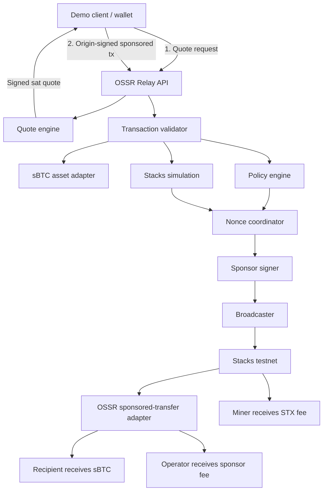

# OSSR Development Plan

> **Project:** Open Stacks Sponsor Relay
> **Document:** Pre-application and Getting Started Grant PoC plan
> **Status:** Draft for implementation
> **Target:** Stacks testnet
> **Last updated:** July 31, 2026

---

## 1. Purpose

OSSR is open token-based fee-abstraction infrastructure for Stacks. It allows a user who holds a supported token but no STX to execute a supported Stacks transaction while an independent relay operator pays the network fee in STX and receives reimbursement in that token.

This document turns the OSSR protocol proposal into a narrow, testable development plan suitable for a Stacks Endowment Getting Started Grant application. The protocol is designed for token-specific reimbursement adapters, but the first PoC implements only sBTC. Assets such as USDCx are Phase 2 candidates and require separate integration and security review.

The first PoC will prove one promise:

> A wallet with testnet sBTC and zero STX can send sBTC; the OSSR relay pays the STX network fee, the recipient receives the requested amount, and the relay receives the exact quoted fee in sats.

This PoC is the **OSSR v0.1** release target. It handles one user action in one sponsored Stacks transaction. Batching is intentionally deferred to **OSSR v0.2**, where it will be implemented and benchmarked only after the v0.1 transaction path provides a working baseline.

The plan has two stages:

1. **Pre-application proof:** a small technical spike built before submitting the grant application.
2. **Grant PoC:** a public, documented testnet implementation delivered through three milestones.

---

## 2. PoC scope

### 2.1 Included

The PoC includes:

- One supported action: **sBTC sponsored transfer**.
- One independently operated OSSR relay.
- One sponsor STX hot wallet.
- A Clarity adapter that atomically:
  - transfers sBTC to the recipient; and
  - reimburses the actual transaction sponsor in sBTC.
- A signed, expiring quote denominated in sats.
- Strict contract and function allowlisting.
- Origin-signed sponsored transactions.
- Relay-side transaction deserialization and validation.
- STX fee estimation.
- Sponsor nonce coordination.
- Transaction simulation before sponsorship.
- Relay-controlled broadcasting.
- A minimal TypeScript SDK or CLI demo client.
- Public testnet deployment.
- Metrics and a testnet pilot report.

### 2.2 Explicitly excluded

The following are outside the first grant:

- Mainnet deployment.
- Sponsored sBTC withdrawals.
- Reimbursement in tokens other than sBTC, including USDCx.
- Arbitrary smart-contract calls.
- Multiple competing relays.
- On-chain relay discovery.
- Reputation, bonding, slashing, or dispute resolution.
- Mobile wallet integration.
- Operator dashboard beyond basic metrics.
- Automated STX/sBTC treasury rebalancing.
- HSM integration.
- Formal external security audit.
- Transaction bundles.
- Batched settlement, payment-intent queues, and the OSSR vault design proposed for v0.2.
- A DAO or protocol token.

These features remain possible Phase 2 work after the core transaction flow is proven.

---

## 3. Product acceptance demo

The final demo must use three testnet accounts:

| Role | Initial state |
|---|---|
| User | Holds testnet sBTC; holds **0 STX** |
| Recipient | Can receive testnet sBTC |
| OSSR operator | Holds enough STX to sponsor transactions |

### Expected flow

1. The user requests a quote for sending sBTC.
2. The relay estimates the STX network fee and returns a signed quote in sats.
3. The client verifies the quote.
4. The user builds a sponsor-enabled contract call.
5. The user adds a fungible-token post-condition limiting total sBTC outflow.
6. The user signs only the origin authorization.
7. The relay deserializes and validates the complete transaction.
8. The relay simulates the transaction.
9. The relay assigns the sponsor nonce and STX fee.
10. The relay signs the sponsor authorization.
11. The relay broadcasts the transaction.
12. On confirmation:
    - the recipient receives the requested sBTC;
    - the relay receives the quoted sBTC fee; and
    - the Stacks miner receives the STX transaction fee.

### Primary acceptance criteria

- The user has zero STX before and after the transaction.
- The user authorizes the recipient, transfer amount, and maximum sBTC outflow.
- The relay cannot alter the origin-authorized application action.
- The relay pays the complete network fee in STX.
- The recipient receives the exact requested amount.
- The relay receives the exact quoted sponsorship fee.
- The transaction is observable through a public testnet explorer.
- The client displays one user-facing cost denominated in sats.

---

## 4. Design decisions

### 4.1 Testnet first

All grant deliverables run on Stacks testnet. Mainnet deployment requires additional operational hardening and security review.

### 4.2 One action first

The relay sponsors only the OSSR sponsored-transfer adapter. Arbitrary contract calls are rejected.

### 4.3 Atomic reimbursement

The user payment to the sponsor and the transfer to the recipient execute in the same Clarity transaction. Both state transitions succeed or both revert.

### 4.4 No custody

The relay never receives custody of the user’s principal transfer amount. It receives only the agreed sponsorship fee during successful execution.

### 4.5 Signed quotes

Quotes are signed by the relay using SIP-018 structured-data signing where practical. A quote is bound to:

- chain and network;
- relay identity;
- sponsor principal;
- origin principal;
- adapter contract;
- function name;
- hash of function arguments;
- reimbursement asset contract, base unit, and precision;
- sponsorship fee in the reimbursement asset's base unit;
- maximum STX fee;
- expiration block;
- quote identifier; and
- policy version.

### 4.6 Relay-controlled broadcast

The relay broadcasts the fully sponsored transaction. The completed serialized transaction is not returned for arbitrary later submission by the client.

### 4.7 Failure risk is explicit

A reverted Stacks transaction can still charge the sponsor an STX processing fee while reverting the sBTC reimbursement. The PoC reduces, but cannot completely remove, this risk through allowlisting, simulation, limits, expiration, and pricing buffers.

---

## 5. Architecture



### Components

#### A. Sponsored-transfer Clarity adapter

Responsible for enforcing the on-chain settlement:

- verifies that a sponsor exists;
- verifies quote expiration;
- enforces sponsor-fee limits;
- pays the fee to `tx-sponsor?`;
- transfers the requested amount to the recipient;
- records or emits the quote identifier;
- rejects already-settled quote identifiers where required; and
- emits structured settlement data.

#### B. Relay API

Accepts quote and sponsorship requests, applies rate limits, performs idempotency checks, and returns stable error codes.

#### C. Quote engine

Calculates a fee in the configured reimbursement asset. For the sBTC PoC:

```text
sponsor fee sats =
estimated STX network cost converted to sats
+ operator margin
+ volatility buffer
+ failed-transaction reserve
```

For the PoC, the STX/BTC conversion source can be operator-configured. The quote response must reveal the pricing inputs or policy version used.

#### D. Reimbursement asset adapter

Defines token-specific behavior behind a common boundary:

- canonical token contract principal;
- base unit and decimal precision;
- quote denomination and conversion;
- sponsored Clarity adapter contract;
- transaction construction and validation;
- fungible-token post-condition templates; and
- asset-specific policy limits.

The PoC ships only the sBTC adapter. Supporting another SIP-010 token is never automatic: a future USDCx integration needs its own reviewed Clarity adapter, conversion and rounding rules, policies, and tests.

#### E. Transaction validator

Deserializes the complete origin-signed transaction and verifies it against the quote and operator policy.

#### F. Policy engine

Permits only the exact OSSR adapter contract and public function, with configured limits for amount, sponsor fee, network fee, quote lifetime, and request rate.

#### G. Sponsor nonce coordinator

Uses one sponsor wallet and a serialized signing queue for the PoC. It tracks:

- confirmed nonce;
- mempool nonce;
- locally reserved nonce;
- pending transaction ID;
- timeout state; and
- dropped or rejected transaction state.

Multiple sponsor wallets are deferred to Phase 2.

#### H. Broadcaster and status monitor

Broadcasts sponsored transactions, stores their transaction IDs, polls status, and records settlement results.

#### I. Demo SDK or CLI

Builds the adapter call, adds post-conditions, verifies relay quotes, requests sponsorship, and displays transaction status.

---

## 6. Proposed repository structure

```text
ossr/
├── crates/
│   ├── relay-server/
│   │   ├── src/
│   │   ├── migrations/
│   │   ├── Cargo.toml
│   │   └── Dockerfile
│   ├── protocol/
│   ├── transaction-validator/
│   └── stacks-gateway/
├── packages/
│   ├── client-sdk/
│   └── demo-cli/
├── contracts/
│   ├── contracts/
│   │   └── sponsored-transfer.clar
│   ├── tests/
│   ├── Clarinet.toml
│   └── settings/
├── docs/specs/
│   ├── relay-api.md
│   ├── quote-format.md
│   ├── policy-manifest.md
│   └── threat-model.md
├── tests/
│   ├── integration/
│   └── adversarial/
├── deployments/
│   ├── docker-compose.yml
│   └── testnet/
├── docs/adr/
├── Cargo.toml
├── pnpm-workspace.yaml
├── DEVELOPMENT.md
├── README.md
├── SECURITY.md
├── LICENSE
└── package.json
```

The relay uses a Cargo workspace. The client SDK, demo CLI, and Clarinet
JavaScript tests use a small `pnpm` workspace. Protocol interoperability is
tested through committed JSON and binary fixtures.

---

## 7. Technology choices

| Layer | Proposed choice |
|---|---|
| Relay language | Rust |
| Async runtime | Tokio |
| API framework | Axum with Tower middleware |
| Stacks transaction support | Pinned Stacks Core crates, gated by cross-language compatibility spike |
| Contract language | Clarity |
| Contract tooling | Clarinet |
| Relay serialization and validation | Serde plus strongly typed domain validation |
| Persistence | PostgreSQL through SQLx |
| Nonce serialization | PostgreSQL transaction, advisory lock, row lock, and single signing worker |
| Relay testing | Rust unit/integration tests plus Clarinet SDK |
| Property testing | `proptest` |
| Client SDK and CLI | TypeScript with `@stacks/transactions` |
| Metrics | Prometheus-compatible endpoint |
| Packaging | Docker |
| CI | GitHub Actions |

Rust is accepted for the security-sensitive relay, subject to a time-boxed
compatibility spike proving sponsored transaction parsing, signing, transaction
IDs, and SIP-018 vectors against the Stacks reference tooling. PostgreSQL is
required even for the single-operator PoC so quote consumption and sponsor nonce
reservation use the same durable locking semantics intended by the architecture.
Redis is not required.

See [ADR 0001](adr/0001-use-rust-for-the-relay.md) and
[ADR 0002](adr/0002-use-postgresql-for-durable-state.md).

---

## 8. Clarity adapter specification

### Proposed public function

The exact interface may change during the pre-application spike, but the intended shape is:

```clarity
(define-public
  (sponsored-transfer
    (amount uint)
    (recipient principal)
    (sponsor-fee uint)
    (quote-id (buff 32))
    (expiry-height uint)
    (memo (optional (buff 34)))))
```

### Required checks

The contract must:

1. Reject the call when `tx-sponsor?` is `none`.
2. Reject the call after `expiry-height`.
3. Reject a sponsor fee above the configured maximum.
4. Reject zero-value transfers where appropriate.
5. Reject an invalid recipient.
6. Prevent confirmed quote reuse where implemented.
7. Transfer `sponsor-fee` sBTC from `tx-sender` to `tx-sponsor?`.
8. Transfer `amount` sBTC from `tx-sender` to `recipient`.
9. Emit a structured event containing:
   - quote ID;
   - origin;
   - sponsor;
   - recipient;
   - amount;
   - sponsor fee; and
   - expiry height.

### Post-conditions

The client must add a fungible-token post-condition limiting user outflow to:

```text
amount + sponsor fee
```

The relay must reject transactions that:

- lack the expected post-condition;
- permit greater sBTC outflow than quoted;
- reference another fungible token;
- use an unexpected post-condition mode; or
- include extra asset transfers.

### Contract test cases

At minimum:

- successful sponsored transfer;
- missing sponsor;
- expired quote;
- excessive sponsor fee;
- insufficient user balance;
- exact recipient amount;
- exact sponsor reimbursement;
- quote reuse;
- invalid or missing post-condition in integration tests;
- transaction abort leaves no sBTC transfer;
- event fields match settlement.

---

## 9. Quote protocol

### Endpoint

```http
POST /v1/quotes
```

### Request

```json
{
  "network": "testnet",
  "origin": "STUSER...",
  "action": "sbtc-transfer",
  "reimbursementAssetId": "sbtc",
  "recipient": "STRECIPIENT...",
  "amountSats": "100000",
  "maxSponsorFeeSats": "100"
}
```

### Signed response

```json
{
  "version": "1",
  "quoteId": "0x...",
  "relayId": "ossr-reference-relay",
  "network": "testnet",
  "origin": "STUSER...",
  "sponsorPrincipal": "STSPONSOR...",
  "reimbursementAsset": {
    "assetId": "sbtc",
    "contractPrincipal": "ST...sbtc-token",
    "unit": "sat",
    "decimals": 8
  },
  "contractId": "ST...sponsored-transfer",
  "functionName": "sponsored-transfer",
  "argumentsHash": "0x...",
  "sponsorFee": "32",
  "maxNetworkFeeMicroStx": "5000",
  "expiresAtBlock": 123456,
  "policyVersion": "2026-01",
  "signature": "0x..."
}
```

### Quote invariants

- Integer values are encoded as decimal strings.
- The quote has a deterministic serialization.
- The signature covers every economically relevant field.
- The reimbursement asset identity, contract, unit, and precision are signed.
- The quote lifetime should be short, initially 5–20 Stacks blocks.
- The `quoteId` must be random or collision-resistant.
- Quotes are single-use.
- A quote is valid for one origin and one action only.
- The relay reserves no sponsor nonce at quote time.
- The user can reject any quote without cost.

---

## 10. Sponsorship API

### Operator information

```http
GET /v1/operator
```

Returns:

- relay ID;
- version;
- network;
- sponsor principal;
- supported actions;
- current policy hash;
- quote public key;
- health status; and
- limits.

### Sponsorship request

```http
POST /v1/sponsor
```

```json
{
  "quoteId": "0x...",
  "originSignedTransaction": "0x..."
}
```

### Sponsorship response

```json
{
  "txid": "0x...",
  "status": "broadcast",
  "quoteId": "0x...",
  "sponsorPrincipal": "STSPONSOR...",
  "reimbursementAssetId": "sbtc",
  "sponsorFee": "32"
}
```

### Status endpoint

```http
GET /v1/transactions/:txid
```

Possible statuses:

- `received`
- `validating`
- `rejected`
- `simulated`
- `signed`
- `broadcast`
- `pending`
- `confirmed`
- `aborted`
- `dropped`

### Error model

Stable machine-readable error codes should include:

- `QUOTE_NOT_FOUND`
- `QUOTE_EXPIRED`
- `QUOTE_ALREADY_USED`
- `QUOTE_SIGNATURE_INVALID`
- `ORIGIN_SIGNATURE_INVALID`
- `NETWORK_MISMATCH`
- `UNSUPPORTED_CONTRACT`
- `UNSUPPORTED_FUNCTION`
- `ARGUMENTS_MISMATCH`
- `POST_CONDITION_INVALID`
- `SPONSOR_FEE_MISMATCH`
- `NETWORK_FEE_TOO_HIGH`
- `INSUFFICIENT_USER_BALANCE`
- `INSUFFICIENT_SPONSOR_BALANCE`
- `SIMULATION_FAILED`
- `ORIGIN_NONCE_CONFLICT`
- `SPONSOR_NONCE_UNAVAILABLE`
- `RATE_LIMITED`
- `BROADCAST_REJECTED`

---

## 11. Relay validation pipeline

The relay must perform the following checks before signing:

1. Load the quote and verify it is unexpired and unused.
2. Verify the quote signature and policy version.
3. Deserialize the origin-signed transaction.
4. Confirm the transaction uses sponsored authorization.
5. Verify the origin signature.
6. Verify network and chain ID.
7. Verify the origin principal and origin nonce.
8. Verify contract address and function name.
9. Decode and compare all function arguments with the quote.
10. Verify sponsor fee, recipient, amount, quote ID, and expiry.
11. Verify sBTC post-conditions.
12. Reject additional unexpected post-conditions or transfers.
13. Confirm the user’s current testnet sBTC balance.
14. Estimate execution cost and network fee.
15. Reject fees above the quote maximum.
16. Simulate the transaction at the current chain tip.
17. Apply per-origin and per-IP rate limits.
18. Reserve the next sponsor nonce.
19. Add STX fee, sponsor nonce, and sponsor signature.
20. Mark the quote as consumed within the same durable operation.
21. Broadcast the transaction.
22. Persist the txid and monitor settlement.

No client-supplied serialized transaction should be signed before full deserialization and comparison.

---

## 12. State model

### Quote record

```text
quote_id
relay_id
origin
network
action
arguments_hash
reimbursement_asset_id
reimbursement_asset_contract
reimbursement_asset_unit
reimbursement_asset_decimals
sponsor_fee_base_units
max_network_fee_microstx
expiry_height
policy_version
signature
status
created_at
used_at
txid
```

Quote statuses:

- `issued`
- `reserved`
- `used`
- `expired`
- `cancelled`

### Transaction record

```text
txid
quote_id
origin
sponsor_principal
origin_nonce
sponsor_nonce
network_fee_microstx
reimbursement_asset_id
sponsor_fee_base_units
broadcast_at
confirmed_at
chain_status
error_code
```

### Nonce reservation

Only one signing worker may reserve and consume a nonce for the PoC sponsor wallet. A reservation must expire or reconcile if broadcast does not occur.

---

## 13. Security model

### Protected assets

- Sponsor wallet STX.
- Relay signing key.
- Quote-signing key.
- User sBTC.
- User transaction intent.
- Relay availability.
- Quote and nonce consistency.

### Main threats and PoC mitigations

| Threat | Mitigation |
|---|---|
| Malicious transaction payload | Full deserialization and comparison against quote |
| Relay changes recipient or amount | Origin signature and user post-conditions |
| Excessive user token transfer | Exact fungible-token post-condition |
| Quote replay | Single-use quote database, origin nonce, expiry |
| Sponsor nonce collision | Serialized signing queue and durable nonce reservation |
| Failed transaction costs relay STX | Simulation, allowlist, short expiry, limits, reserve margin |
| STX/BTC price movement | Short-lived quote and configurable volatility buffer |
| Sponsor wallet theft | Small hot-wallet balance, environment isolation, withdrawal limits |
| API resource exhaustion | Request-size limits, rate limits, timeouts |
| Privacy leakage | Minimal logs, no unnecessary analytics, retention policy |
| Client withholds completed tx | Relay-controlled broadcast |
| Database crash after signing | Idempotency keys and startup reconciliation |

### Key management

For the PoC:

- Use separate keys for quote signing and transaction sponsorship.
- Load secrets from environment variables or a secrets file excluded from Git.
- Run the relay with a low-balance testnet sponsor wallet.
- Never log private keys or complete secret-bearing environment variables.
- Document production migration to a KMS or HSM, but do not include it in the grant scope.

---

## 14. Testing strategy

### 14.1 Unit tests

- Quote serialization and signature verification.
- Fee calculation.
- Policy matching.
- Transaction field comparison.
- Post-condition validation.
- Quote expiration.
- Idempotency.
- Nonce reservation.
- Error-code mapping.

### 14.2 Clarity tests

- Every contract branch and error code.
- Exact amount settlement.
- Exact sponsor settlement.
- Expiration boundaries.
- Maximum fee boundaries.
- Replay behavior.
- Event output.

### 14.3 Integration tests

Run against Clarinet simnet/devnet first, then testnet:

- Complete successful sponsored transfer.
- User with zero STX.
- Expired quote rejection.
- Modified recipient rejection.
- Modified amount rejection.
- Modified fee rejection.
- Wrong contract rejection.
- Wrong function rejection.
- Missing post-condition rejection.
- Excessive post-condition rejection.
- Insufficient sBTC rejection.
- Duplicate submission rejection.
- Origin nonce conflict.
- Sponsor nonce conflict.
- Simulation failure.
- Broadcast failure and retry reconciliation.

### 14.4 Adversarial tests

- Fuzz quote fields.
- Fuzz Clarity arguments.
- Oversized API bodies.
- Concurrent sponsorship requests.
- Repeated quote submissions.
- Intent submission to two relay instances.
- Database interruption between nonce reservation and broadcast.
- Stale chain-tip simulation.
- Delayed broadcast after quote expiry.

### 14.5 Pilot target

The public testnet pilot should complete:

- at least **100 successful sponsored transactions**;
- at least **10 distinct test wallets**;
- at least **20 intentionally rejected invalid requests**;
- zero cases of user outflow exceeding `amount + sponsor fee`;
- zero duplicate quote settlements; and
- a documented record of all on-chain aborts and relay losses.

---

## 15. Metrics

Expose a minimal `/metrics` endpoint or structured report containing:

- quotes issued;
- quotes expired;
- sponsorship requests;
- validation rejections by reason;
- simulations passed and failed;
- transactions broadcast;
- transactions confirmed;
- transactions aborted;
- quote-to-broadcast conversion;
- confirmation success rate;
- median sponsor fee in sats;
- median STX fee;
- quoted-versus-actual STX fee difference;
- sponsor revenue in sBTC;
- STX lost to aborted transactions;
- sponsor nonce incidents;
- API latency;
- relay uptime; and
- transactions completed by users with zero STX.

The primary metric is:

> Percentage of supported transactions successfully completed by users whose STX balance is zero.

---

## 16. Pre-application proof

Before applying for the grant, OSSR should demonstrate that the core technical assumptions work.

### Duration

Approximately 1–2 focused development weeks.

### Objectives

- Confirm current Stacks sponsored-transaction construction.
- Confirm access to `tx-sponsor?` in the adapter.
- Confirm testnet or devnet sBTC contract interaction.
- Build one origin-signed and sponsor-signed transaction.
- Demonstrate that the sponsor pays STX.
- Demonstrate atomic recipient payment and sponsor reimbursement.
- Document unresolved technical risks.

### Pre-application tasks

#### Transaction sponsorship spike

- [ ] Create a sponsor-enabled contract-call transaction with `@stacks/transactions`.
- [ ] Sign the origin authorization.
- [ ] Deserialize it in a separate sponsor script.
- [ ] Add sponsor nonce and STX fee.
- [ ] Sign the sponsor authorization.
- [ ] Broadcast on devnet or testnet.
- [ ] Record transaction ID and screenshots/logs.

#### Adapter spike

- [ ] Create a minimal `sponsored-transfer.clar`.
- [ ] Confirm `tx-sponsor?` behavior.
- [ ] Transfer a mock SIP-010 asset in simnet if testnet sBTC is temporarily unavailable.
- [ ] Add exact user outflow post-conditions.
- [ ] Confirm successful atomic settlement.
- [ ] Confirm both transfers revert when one condition fails.

#### Minimal relay spike

- [ ] Implement a local `POST /quote`.
- [ ] Implement a local `POST /sponsor`.
- [ ] Use one sponsor wallet and one serialized nonce queue.
- [ ] Reject an altered transaction payload.
- [ ] Persist quote usage.

#### Application evidence

- [ ] Record a short end-to-end demo.
- [ ] Publish contract tests.
- [ ] Publish at least one testnet transaction, or clearly document why the proof uses devnet.
- [ ] Open GitHub issues matching grant milestones.
- [ ] Publish this `DEVELOPMENT.md`.
- [ ] Add architecture and threat-model diagrams.
- [ ] Identify one wallet or app developer willing to review the API.

### Pre-application readiness gate

Apply when all of the following are true:

- A rough end-to-end proof works on devnet or testnet.
- The repository contains executable code, not only a proposal.
- The grant scope is limited to one supported action.
- The main security limitation is clearly disclosed.
- Each grant milestone has objective acceptance tests.
- A reviewer can reproduce the proof from repository instructions.

---

## 17. Grant development roadmap

The Stacks Endowment Getting Started track asks for two to four concrete milestones that can be completed in roughly 8–12 weeks. OSSR proposes three milestones over eight weeks.

### Milestone 1 — Protocol and atomic adapter

**Schedule:** Weeks 1–2
**Suggested allocation:** USD 3,000 equivalent in STX

#### Deliverables

- Relay API specification.
- SIP-018 signed quote format.
- Policy manifest format.
- Threat model.
- Sponsor-fee accounting model.
- `sponsored-transfer.clar`.
- Clarinet unit tests.
- Post-condition construction templates.

#### Acceptance criteria

- A client can independently verify a relay quote.
- Every quote is bound to one network, origin, action, fee, and expiry.
- The adapter directs reimbursement to the actual sponsor.
- Recipient transfer and sponsor payment settle atomically.
- All contract tests pass in CI.
- Unsupported transaction types are documented.

---

### Milestone 2 — Reference relay and end-to-end testnet flow

**Schedule:** Weeks 3–5
**Suggested allocation:** USD 4,000 equivalent in STX

#### Deliverables

- Rust relay daemon.
- Quote engine.
- Transaction validator.
- Allowlist policy engine.
- Sponsor nonce coordinator.
- Simulation integration.
- Relay-controlled broadcaster.
- PostgreSQL persistence and migrations.
- Docker deployment.
- Initial testnet deployment.

#### Acceptance criteria

- A user with testnet sBTC and zero STX sends sBTC.
- The sponsor pays the STX network fee.
- The recipient receives the requested sats.
- The relay receives the quoted sats.
- Modified or unsupported transactions are rejected.
- Failed simulations are rejected before sponsor signing.
- Duplicate quote submissions are rejected.
- The complete flow runs from a documented CLI command.

---

### Milestone 3 — Client SDK, public pilot, and documentation

**Schedule:** Weeks 6–8
**Suggested allocation:** USD 3,000 equivalent in STX

#### Deliverables

- Minimal TypeScript client SDK or CLI.
- Quote verification.
- Post-condition builder.
- Transaction status tracking.
- Public relay endpoint for the pilot.
- Integration and adversarial test suite.
- Operational runbook.
- Public testnet pilot report.
- Final demonstration video.

#### Acceptance criteria

- At least 100 successful sponsored testnet transactions.
- At least 10 test wallets participate.
- Invalid request scenarios are documented and reproducible.
- Public documentation allows a second developer to run a relay.
- Metrics report sponsor fees, STX costs, failures, and nonce incidents.
- All source code and specifications are published under an open-source license.

---

## 18. Week-by-week execution

| Week | Focus | Output |
|---:|---|---|
| Pre-1 | Sponsored transaction and adapter spike | Reproducible technical proof |
| Pre-2 | Minimal local relay and application evidence | Demo, issues, refined scope |
| 1 | Quote and policy specification | Versioned protocol drafts |
| 2 | Clarity adapter and tests | Deployed/tested contract |
| 3 | Relay API, storage, quote engine | Working quote service |
| 4 | Validator, simulation, policy engine | Safe sponsorship pipeline |
| 5 | Nonce coordinator and testnet deployment | End-to-end testnet transaction |
| 6 | SDK/CLI and status tracking | Reproducible user workflow |
| 7 | Adversarial testing and public pilot | Pilot dataset |
| 8 | Fixes, documentation, report, video | Grant completion package |

---

## 19. Definition of done

The grant PoC is complete when:

- [ ] The user can start with testnet sBTC and zero STX.
- [ ] The user receives and verifies a sat-denominated quote.
- [ ] The user signs a sponsor-enabled transaction.
- [ ] The relay validates the complete transaction.
- [ ] The relay simulates before signing.
- [ ] The relay pays the STX network fee.
- [ ] The recipient receives the requested sBTC.
- [ ] The relay receives the exact quoted sBTC fee.
- [ ] User post-conditions cap total sBTC outflow.
- [ ] Quotes expire and cannot be reused.
- [ ] Sponsor nonce handling survives concurrent requests.
- [ ] The public pilot meets its transaction target.
- [ ] A third party can reproduce the demo.
- [ ] Source, tests, specifications, and deployment instructions are public.
- [ ] Known limitations and on-chain failure costs are documented.

---

## 20. Grant application evidence package

The application should link to:

1. OSSR repository.
2. `README.md` proposal.
3. This `DEVELOPMENT.md`.
4. Working devnet or testnet proof.
5. Contract test output.
6. End-to-end demo video.
7. Architecture diagram.
8. Threat model.
9. Three milestone descriptions.
10. Budget and eight-week timeline.
11. Founder technical background and relevant Stacks work.
12. Any review or letter of interest from a wallet, sBTC app, or relay operator.

### Suggested application summary

> Open Stacks Sponsor Relay (OSSR) will deliver an open-source reference relay that allows a user holding sBTC and zero STX to send sBTC on Stacks. The user signs the application action, an independent relay validates and sponsors the transaction with STX, and the relay receives an atomically settled fee in sats. The eight-week PoC includes an sBTC Clarity sponsored-transfer adapter, a Rust relay daemon, a minimal TypeScript client SDK, a public testnet deployment, and a 100-transaction pilot. The relay protocol is asset-aware so future reviewed adapters can support other Stacks tokens, such as USDCx, without changing the core sponsorship pipeline.

---

## 21. Risks and fallback plans

### Testnet sBTC availability

**Risk:** Testnet minting, contract interfaces, or infrastructure may be temporarily unavailable.

**Fallback:** Prove contract semantics with a mock SIP-010 token in Clarinet while continuing integration against the official testnet contract. The final grant acceptance test still requires testnet sBTC unless the program manager approves another environment.

### Simulation mismatch

**Risk:** Chain state changes after simulation and causes execution to abort.

**Fallback:** Use short quote expirations, conservative limits, fee reserve, deterministic transfer-only action, and record all losses.

### Nonce congestion

**Risk:** A pending sponsor transaction blocks later requests.

**Fallback:** Serialize sponsorship and stop accepting new transactions when the pending chain exceeds the configured threshold. Multi-wallet coordination is deferred.

### Price conversion

**Risk:** STX/BTC conversion changes between quote and execution.

**Fallback:** Use short-lived quotes and a configurable buffer. For the pilot, pricing transparency is more important than maximizing operator profit.

### Contract integration uncertainty

**Risk:** Exact sBTC transfer interfaces or sponsor behavior differ from initial assumptions.

**Fallback:** Resolve in the pre-application spike and version the contract interface before grant submission.

### Scope expansion

**Risk:** Withdrawal support, generic calls, multiple relays, or reputation distract from the core proof.

**Fallback:** Treat any non-transfer action as a Phase 2 issue and do not include it in milestone acceptance.

---

## 22. Phase 2 candidates

After the PoC succeeds:

- OSSR v0.2 batching prototype and testnet benchmarks, following the draft [batching protocol](specs/batching-protocol.md).
- Sponsored sBTC withdrawal.
- USDCx reimbursement adapter and sponsored actions.
- Additional reviewed SIP-010 reimbursement assets.
- Multiple independent relay operators.
- Relay discovery manifests.
- Quote comparison and routing.
- Operator reputation based on signed receipts and on-chain outcomes.
- Sponsor bonds.
- Wallet integrations.
- Application-funded sponsorship.
- Multi-wallet nonce coordination.
- PostgreSQL and Redis deployment.
- HSM/KMS signing.
- Mainnet security review.
- Standard sponsored-action adapter trait.
- Transaction-bundle integration if activated by Stacks.
- Privacy-preserving relay access and Tor endpoints.

---

## 23. References

- OSSR proposal: <https://github.com/fabohax/ossr>
- Stacks transaction fee sponsorship: <https://docs.stacks.co/learn/sbtc/auxiliary-features/transaction-fee-sponsorship>
- Stacks.js sponsored transactions: <https://stacks.js.org/modules/_stacks_transactions>
- SIP-018 structured data signing: <https://docs.stacks.co/reference/stacks.js/stacks-transactions/signing/signstructureddata>
- Stacks transaction post-conditions: <https://docs.stacks.co/learn/transactions/post-conditions>
- Stacks Endowment Getting Started track: <https://stacksendowment.co/grants-docs/getting-started-program-track>
